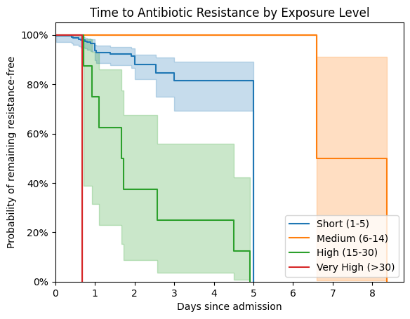
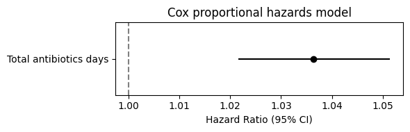
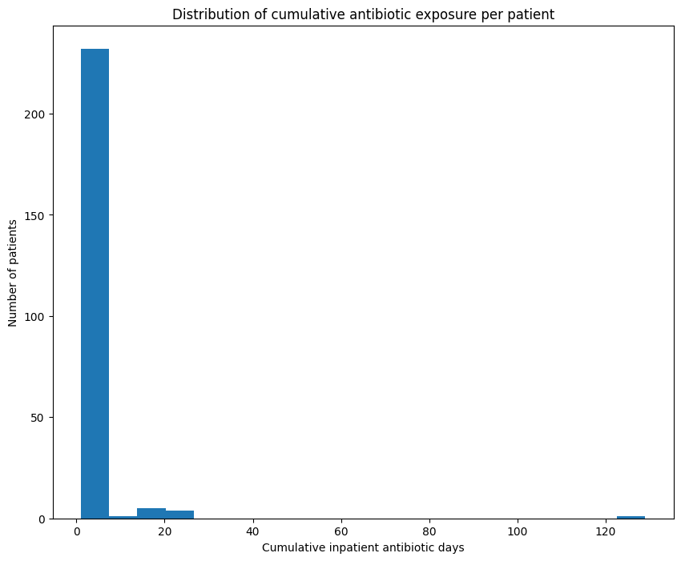
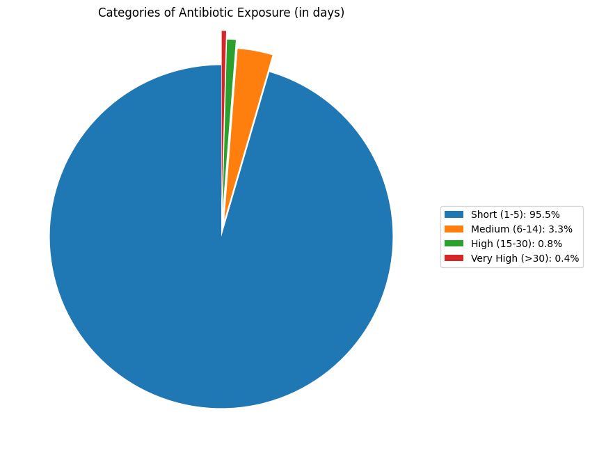
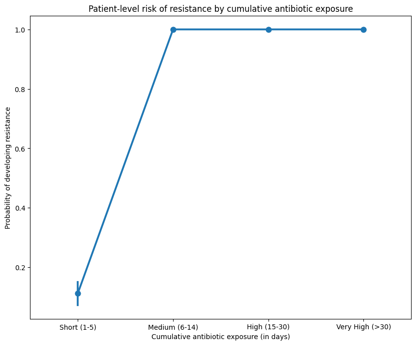
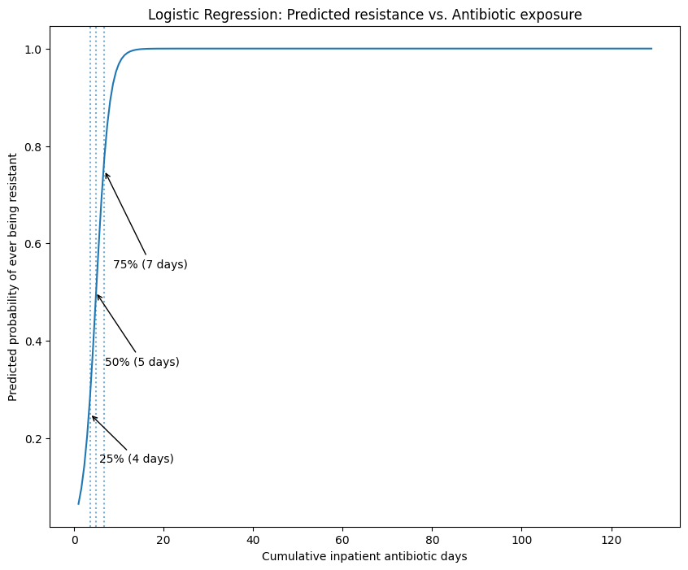

*Image credit: ChatGPT*

This project explores the relationship between **inpatient antibiotic exposure** and **antimicrobial resistance** using synthetic, observational-style hospital data generated with **Synthea**.

Rather than making causal claims, the goal is to demonstrate a **disciplined, end-to-end health data analysis workflow**, covering data preparation, temporal analysis, regression modeling, and careful interpretation.

---

## 🌍 Why this project matters

Antimicrobial resistance is closely linked to antibiotic exposure, yet real-world clinical data are often censored, imbalanced, and non-linear. Many analyses focus on model outputs alone. This project emphasizes **responsible analysis**, correct use of methods, and thoughtful interpretation.

---

## 🗂️ Data Overview

Two analysis-ready datasets were derived from synthetic health records:

- **Admission-level data**  
  One row per hospital admission, including antibiotic timing, total exposure days, and simulated resistance events.

- **Patient-level data**  
  Aggregated across admissions, capturing cumulative antibiotic exposure and ever-resistant status.

> ⚠️ Resistance events and time-to-event outcomes were synthetically generated for demonstration purposes only.

---

## ⏱️ Admission-Level (Temporal) Analysis

Time-to-event methods were used to examine **when** resistance occurred.

Kaplan–Meier curves illustrate differences in resistance timing and censoring across exposure strata, with instability observed at extreme exposure levels.

A Cox proportional hazards model showed a modest, consistent increase in hazard with additional antibiotic days.

---

## 📊 Patient-Level (Cumulative) Analysis

Cumulative antibiotic exposure at the patient level was **strongly right-skewed**, with most patients receiving short courses and a small subset accumulating prolonged therapy.

| Distribution of cumulative exposure | Exposure categories |
| --- | --- |
|  |  |

Higher cumulative exposure was associated with a greater proportion of resistance events.

---

### 📈 Logistic Regression

A logistic regression model demonstrated a clear exposure–response relationship, with resistance probability increasing monotonically and plateauing at higher durations.

---

## 🔍 Key Findings

- Survival analysis highlighted instability at extreme exposure levels  
- Patient-level aggregation supported admission-level patterns  
- Patient-level cumulative antibiotic exposure was strongly right-skewed  
- Higher cumulative exposure was associated with increased resistance probability  
- Logistic regression showed a clear exposure–resistance relationship  

---

## 🧩 Strengths and Limitations

### ✅ Strengths
- Clear separation of admission-level and patient-level analyses  
- Complementary use of survival and regression methods  
- Clinically interpretable visualizations  
- Reproducible, well-documented workflow  

### ⚠️ Limitations
- Resistance events and timing were simulated  
- No adjustment for illness severity or treatment indication  
- Findings are illustrative and hypothesis-generating  

---

## 🛠️ Tools

Analysis was conducted in Python using `pandas`, `numpy`, `matplotlib`, `seaborn`, `statsmodels`, and `lifelines`.
